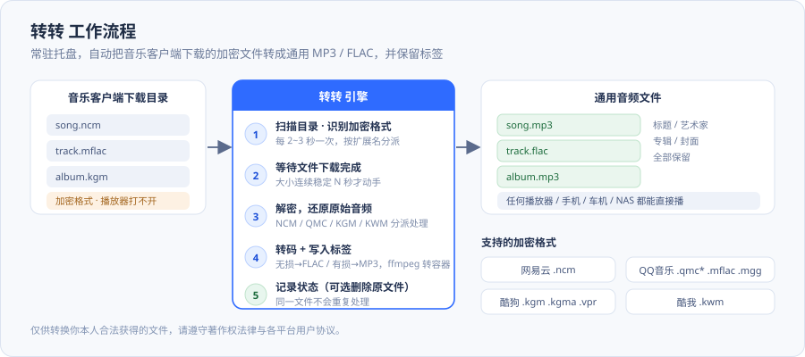

# 转转 · 加密音频批量转换工具

> **盯着你的音乐下载目录，一有新文件就自动转换格式**，常驻系统托盘，不用管它。

转转是一个 Windows 桌面小工具：你照常用各大音乐客户端下载歌曲，它在后台默默把**加密格式**的文件转换成**通用的 MP3 / FLAC**，并保留标题、艺术家、封面等标签信息。转完之后的文件可以放进任何播放器、手机、车机或 NAS。



---

## ⚠️ 使用前必读（免责声明）

**本项目包含对音乐平台加密文件格式的解密实现，请在合法范围内使用。**

- 本工具**只能**用于转换**你自己合法获得**的文件。请遵守你所在地区的著作权法律与各音乐平台的用户协议。
- 请**不要**用它来传播、分发或商业利用受版权保护的音乐作品。
- 各平台加密格式的技术细节属于平台方，本项目**不含**任何绕过会员/付费权限的能力——它只做「把已下载到本地的文件还原成通用音频格式」这一件事。
- **使用本工具产生的一切后果由使用者自行承担。**
- 如果你是版权方并认为本项目侵犯了你的权益，请通过 issue 联系，我会配合处理。

---

## 目录

- [支持的格式](#支持的格式)
- [下载安装](#下载安装)
- [快速上手](#快速上手)
- [界面怎么用](#界面怎么用)
- [命令行 / 后台服务](#命令行--后台服务)
- [它是怎么做到的](#它是怎么做到的)
- [常见问题](#常见问题)
- [已知限制](#已知限制)
- [从源码运行与打包](#从源码运行与打包)
- [项目结构](#项目结构)
- [许可](#许可)

---

## 支持的格式

| 平台 | 加密扩展名 |
| --- | --- |
| 网易云音乐 | `.ncm` |
| QQ 音乐 | `.mflac` `.mgg` `.qmc0` `.qmc2` `.qmc3` `.qmcflac` `.qmcogg` |
| 酷狗音乐 | `.kgm` `.kgma` `.vpr` |
| 酷我音乐 | `.kwm` |

**输出格式**

| 情况 | 输出 |
| --- | --- |
| 原始音频本身就是无损（FLAC 内核） | 直接还原为 **FLAC** |
| 原始音频是有损（MP3/AAC 内核） | 还原为 **MP3** |
| 需要转换容器时 | 调用 **ffmpeg** 转码（安装包已内置 ffmpeg） |

> 转转**不会**把有损音源「升级」成无损——输出质量取决于你下载到的原始文件。

---

## 下载安装

从 [**Releases 页面**](../../releases/latest) 下载 `转转_Setup_2.0.0.exe`，双击安装。

| 项目 | 说明 |
| --- | --- |
| 系统要求 | Windows 10 / 11（64 位） |
| 需要 Python 吗 | **不需要**，安装包已包含运行时与 ffmpeg |
| 需要管理员权限吗 | **不需要**，不弹 UAC（装到用户目录） |
| 默认安装位置 | `%LOCALAPPDATA%\Programs\转转` |
| 配置与日志 | `%APPDATA%\转转\` |
| 卸载 | 控制面板「程序和功能」→ 转转 |

---

## 快速上手

1. 双击 `转转_Setup_2.0.0.exe` 完成安装
2. 打开 **转转**（开始菜单），右下角出现一个托盘图标
3. 在设置窗口里**勾选你要监听的平台**，并确认它们的下载目录（一般会自动填好常见路径）
4. 点「保存」——之后就不用管了
5. 去音乐客户端下载几首歌，几秒后你会看到下载目录里出现同名的 `.mp3` / `.flac`

> 默认会**删除**转换成功的加密原文件（避免占地方）。想保留原文件的话，在设置里关掉对应开关。

---

## 界面怎么用

| 元素 | 说明 |
| --- | --- |
| 平台勾选框 | 每个平台一行，勾上才监听它的下载目录 |
| 目录输入框 | 该平台的下载目录，可点「浏览」选择 |
| 开机自启动 | 勾上后登录 Windows 时自动以托盘方式启动 |
| 保存 | 写入配置并立即生效，不需要重启程序 |
| 关闭窗口 | **只是隐藏窗口**，程序继续在托盘运行；要退出请用托盘菜单 |

托盘菜单：显示窗口 / 立即转换一次 / 打开日志 / 退出。

---

## 命令行 / 后台服务

除了 GUI，仓库里还带了一个**无界面后台服务**，适合做开机自启或无人值守：

```bat
:: 持续监视（按配置的目录）
python ncm_bg_service.py

:: 只在你打开网易云时才运行
python ncm_bg_service.py --bind

:: 清空转换记录，重新处理目录里的所有文件
python ncm_bg_service.py --reset

:: 注册 / 移除开机自启
python ncm_bg_service.py --install
python ncm_bg_service.py --uninstall
```

要改监视目录，设一个环境变量即可（也可以直接改源码顶部的默认值）：

```bat
set ZHUANZHUAN_WATCH_DIR=D:\Music\CloudMusic\VipSongsDownload
```

还有一个纯命令行的转换入口：

```bat
python ncm_standalone.py
```

---

## 它是怎么做到的

```
① 监视    每 2~3 秒扫描一次下载目录，只挑出支持的加密扩展名
② 稳定    等文件大小连续稳定（避免转一个还没下载完的文件）
③ 解密    按扩展名分派到对应解密器，还原出原始音频内核
④ 转换    无损内核 → FLAC；有损内核 → MP3；需要换容器时调用 ffmpeg
⑤ 标签    用 mutagen 把曲名 / 艺术家 / 专辑 / 封面写进新文件
⑥ 收尾    可选删除原加密文件，并记录到状态文件（避免重复处理）
```

各平台用到的技术手段（**仅描述本项目的实现方式**）：

| 格式 | 做法 |
| --- | --- |
| NCM | 文件内嵌密钥块（AES-128-ECB）解出音频密钥，再解出音频数据；元数据单独解析 |
| QMC v1/v2 | 密钥由文件头给出或按内置映射表推导，逐字节 XOR |
| KGM / VPR | 头部密钥派生后按块解密 |
| KWM | 头部密钥 + 自定义流密码 |

工程上处理的几个实际问题：

- **文件还没下载完就被转换** → 先做「大小连续稳定 N 秒」检测
- **同名文件重复处理** → 状态文件记录已处理项，也可 `--reset` 重来
- **目录不存在** → 不崩溃，只是扫不到文件
- **打包后找不到资源** → 统一用 `sys._MEIPASS` 回退到自身目录查找图标与 ffmpeg
- **动态导入的模块被 PyInstaller 漏掉** → 用 `--hidden-import` 显式声明（见 `build.py`）

---

## 常见问题

**Q：转出来的文件还是加密的 / 打不开？**
A：先确认该文件确实来自受支持的平台与扩展名。个别平台的**新版客户端**会改加密方式，请提 issue 并附上文件头信息。

**Q：会不会转坏我的文件？**
A：不会改原文件，只会**新增**文件；只有在开启「删除原文件」时才会删掉加密的那份（且只在转换成功后）。

**Q：转出来的 FLAC 怎么比我下载的还小？**
A：原文件是无损内核时才能还原无损。如果你下的是「标准音质」，还原出来的就是有损音质对应的内容。

**Q：需要装 ffmpeg 吗？**
A：用 Release 里的安装包**不需要**（已内置）。从源码跑或自己打包时，若 `--skip-ffmpeg` 打包则要求目标机 PATH 里有 ffmpeg。

**Q：为什么不做成跨平台？**
A：目标用户是 Windows 上的国内音乐客户端用户，且部分客户端只在 Windows 上可用。Linux/macOS 用户的核心需求场景不同。

---

## 已知限制

- 只支持 **Windows**（安装包为 x64）
- 只能处理**已下载到本地**的文件，不涉及任何在线抓取
- 各音乐平台**升级加密算法**后可能失效，需要跟进适配
- 有损音源无法还原成真正无损
- 「删除原文件」一旦开启且你已清空回收站，原文件不可恢复，请先确认目录再开

---

## 从源码运行与打包

```bat
:: 1) 装依赖
pip install -r requirements.txt

:: 2) 直接运行 GUI
python ncm_tray_app.py

:: 3) 打包成单文件 exe（产物在 dist\ ）
python build.py

:: 4) 生成安装包（需要 Inno Setup 6）
iscc installer\setup.iss
```

`build.py` 会自动定位解释器、`libtakiyasha` 的数据文件与 `ffmpeg`，**不需要改任何路径**：

- ffmpeg：环境变量 `FFMPEG_EXE` → 系统 `PATH` → 常见安装位置
- 不想内嵌 ffmpeg：`python build.py --skip-ffmpeg`

---

## 项目结构

```
audio-format-converter/
├── ncm_tray_app.py        GUI 主程序（托盘 + 设置窗口，PySide6）
├── zhuanzhuan.py          多格式解密调度（NCM / QMC / KGM / KWM）
├── ncm_decrypt.py         NCM 解密实现 + 命令行入口
├── ncm_bg_service.py      无界面后台监视服务
├── ncm_standalone.py      独立运行入口（自动定位 ffmpeg）
├── build.py               一键打包脚本
├── requirements.txt       依赖清单
├── assets/                图标资源
├── installer/setup.iss    Inno Setup 安装包脚本
├── tools/out/             发布产物的 SHA256 校验值
├── docs/                  补充文档
└── RELEASE_NOTES.md / CHANGELOG.md
```

---

## 许可

**本项目未附开源许可证（All rights reserved）。**

代码公开可见，但默认**不授予**复制、修改、再分发或商用的权利。
如需以某种开源许可证发布或授权使用，请通过 issue 联系作者。

再次提醒：**请仅在合法范围内使用本工具**，只用它转换你自己合法获得的文件。

---

<sub>作者：Yachiyo</sub>
